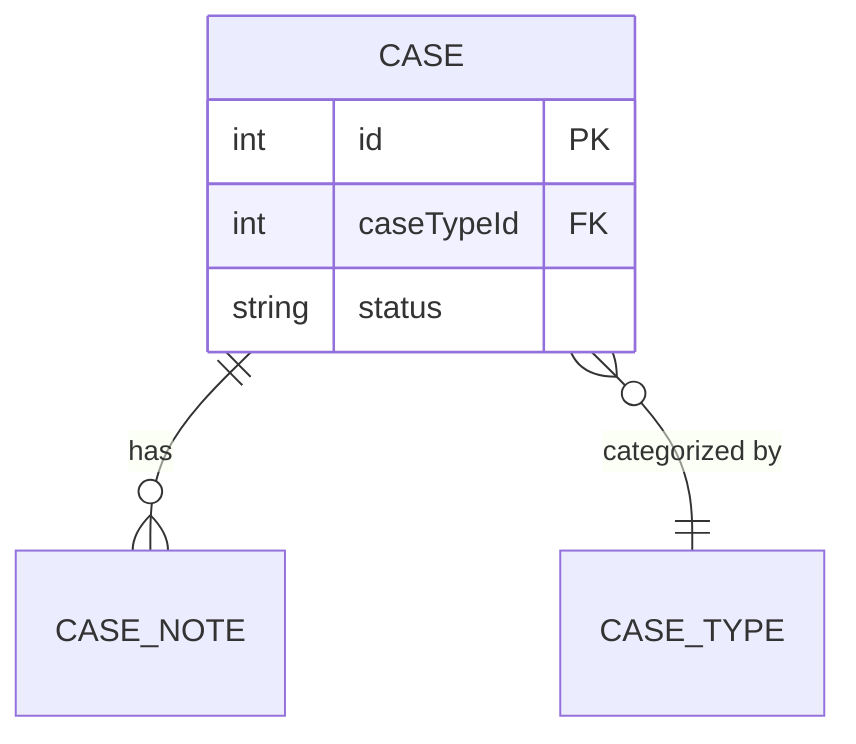
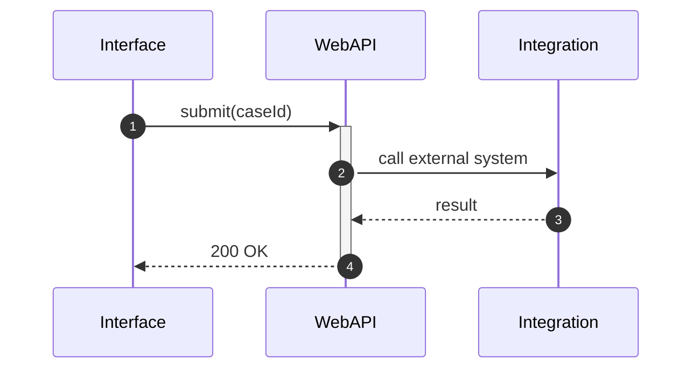
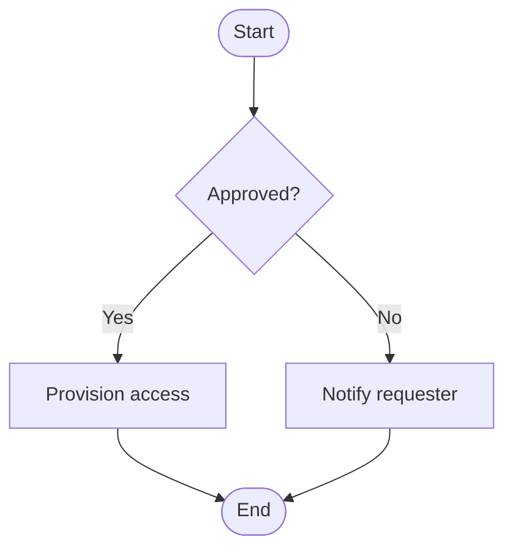
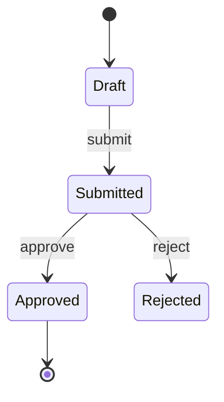
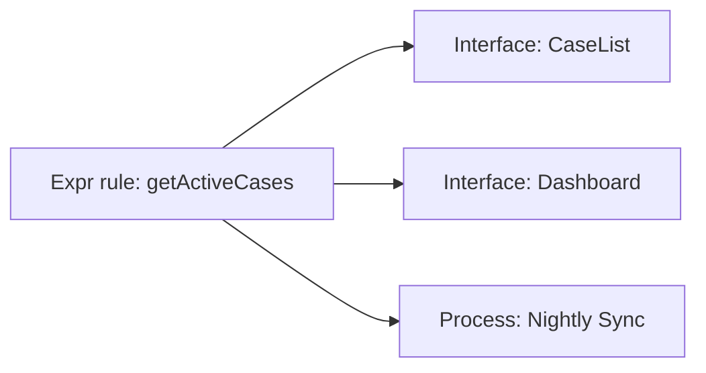

# To-diagram — render a Mermaid diagram

The plugin's shared **diagram primitive**. When a picture would explain something better than
prose — the shape of an app, a record model, a change's blast radius, the order of build steps, a
ticket dependency graph, a status lifecycle, an integration flow — this skill renders it as a
**Mermaid** diagram, saves it to the `outputs/` workspace, and presents it as an artifact.

It is advisory, like everything in this plugin: a diagram is a **document**, not a build.
To-diagram draws pictures of the app and the plan; it never creates or mutates Appian objects.

Most of the plugin reaches this skill through the flow skills — `/orient` draws the app's topology
and ERD, `/to-spec` the build-step DAG, `/pressure-test` the blast radius, `/to-tickets` the ticket
dependency graph. You can also invoke it directly ("diagram how these records relate").

## Save and present

A diagram is a **Markdown file** — a fenced ` ```mermaid ` block, nothing more. That one file is
both what you present and what you save; there is no separate HTML page to build.

- **Present it — as Markdown.** Publish the `.md` as an artifact. Claude renders Mermaid natively
  from a ` ```mermaid ` fence, so the diagram *is* the content — **do not** hand-build an HTML/CSS
  page or reach for a page-design skill around it. The render is also your validation: a syntax
  error shows immediately, so fix it against the gotchas below and re-render.
- **Save it — same file, offer first, never auto-write.** The artifact and the saved file are the
  same Markdown. Propose the save and write only on a yes. Then:
  - If the diagram belongs to an artifact you're writing anyway — a `/to-spec` build spec, a
    `/pressure-test` `decisions.md` — **embed it there** as a ` ```mermaid ` block, not a separate file.
  - Otherwise save a standalone `outputs/diagrams/<slug>.md` (no ticket in view) or
    `outputs/<TICKET-KEY>/diagrams/<slug>.md` (ticket-scoped). Create the folder lazily.
  - Verify it landed and report the path.
- **Mind where it goes.** An artifact is default-private but hosted off the local machine, whereas
  the rest of what this plugin writes stays local (and git-ignored, where `/setup`'s ignore
  rules were accepted). For a sensitive client's app-architecture
  diagram, skip the hosted artifact — the saved `.md` renders wherever Mermaid does (GitHub, VS
  Code, the repo) with no upload.

## Choose the diagram type

```
What are you visualizing?
├─ A process / decision flow / an Appian process model   → flowchart
├─ An integration or Web API call over time              → sequenceDiagram
├─ A record model / data model / table relationships     → erDiagram
├─ A type hierarchy / domain model                       → classDiagram
├─ A status lifecycle / state machine                    → stateDiagram-v2
├─ App structure / object topology / dependencies        → flowchart (+ subgraphs)
├─ Blast radius — what a change touches                  → flowchart (fan-in / fan-out)
├─ Build-step or ticket dependency order (a DAG)         → flowchart
├─ A rollout / sprint timeline                           → gantt or timeline
├─ Prioritization (effort vs. impact)                    → quadrantChart
└─ …anything else                                        → the types table below
```

Default to `flowchart` when unsure — it carries most "draw the system / process" requests, and it
renders everywhere. Prefer a plain flowchart with subgraphs over `architecture-beta`/C4 unless
those are specifically asked for.

## Diagram types

| Type | Declaration | Best for |
|------|-------------|----------|
| Flowchart | `flowchart LR` / `TB` | Processes, decisions, dependencies, blast radius, DAGs |
| Sequence | `sequenceDiagram` | Integration / Web API flows over time |
| ER | `erDiagram` | Record models, database schemas |
| Class | `classDiagram` | Type hierarchies, domain models |
| State | `stateDiagram-v2` | Record status lifecycles, state machines |
| Gantt | `gantt` | Rollout / sprint timelines |
| Timeline | `timeline` | Chronological milestones |
| Quadrant | `quadrantChart` | Priority matrices (effort vs. impact) |
| Mindmap | `mindmap` | Concept hierarchies, brainstorming |
| Pie / XY / Sankey | `pie` / `xychart` / `sankey` | Distributions, trends, flow allocation |
| Journey | `journey` | User-experience mapping |
| Git | `gitGraph` | Branch visualization |
| C4 / Architecture / Block | `C4Context` / `architecture-beta` / `block` | System/cloud topology (specialized) |
| Kanban / Packet / Requirement | `kanban` / `packet` / `requirementDiagram` | Boards, protocol layouts, requirements traceability |

The `-beta` declarations (`xychart-beta`, `packet-beta`, `block-beta`, `sankey-beta`) still parse
as legacy aliases; prefer the stable keyword, but on a platform bundling an older Mermaid the
`-beta` form may be the only one that renders — test with a small diagram when targeting a specific
platform.

## Common patterns (Appian-flavored)

### Record model → ERD



### Integration / Web API → sequence



### Process model → flowchart



### Record status lifecycle → state machine



### Blast radius → fan-in flowchart



## Gotchas that break rendering

These are the errors most likely to fail to parse or render wrong:

1. **`end` is reserved in flowcharts.** A lowercase node `end` terminates a subgraph and breaks the
   parser — use `End`, `e[end]`, or quote it. Same care for nodes named `o`/`x` right after an edge
   (`A---oB` parses as a circle-ended edge) — add a space or capitalize.
2. **Node IDs must not collide with subgraph IDs** — `subgraph Build` plus a node `Build` throws
   "would create a cycle." Give the node a distinct id and put the label in brackets: `Compile[Build]`.
3. **Special characters need quotes.** Labels with `()[]{}:;`, or starting with a number, often
   break parsing — wrap in double quotes: `A["Fetch (retry x3)"]`. Escape inside with entities
   (`#quot;`, `#35;`).
4. **Comments are `%%` on their own line** — never `//` or `#`, and never trailing on a syntax line.
5. **One diagram per block, declaration first** — the first non-comment line is the diagram type.
6. **ER attribute blocks are line-based** — one attribute per line inside `ENTITY { }`; combine key
   constraints with commas (`int user_id FK, UK`).
7. **Sequence participants with spaces need an alias** — `participant W as Web API`, then use `W`.

## Reference documentation

Read the matching reference before generating anything beyond a basic diagram of that type — the
syntax has sharp edges, and these carry the full, verified detail:

| Read | Before generating |
|------|-------------------|
| `references/FLOWCHARTS.md` | Flowcharts with shapes, subgraphs, styling, ELK layout, animated edges |
| `references/SEQUENCE.md` | Sequence diagrams with activation, alt/opt/loop/par, notes, boxes |
| `references/CLASS-ER.md` | Class diagrams (generics, annotations, namespaces) or ER / record models |
| `references/STATE-JOURNEY.md` | State machines (composite, fork/join, choice) or user journeys |
| `references/DATA-CHARTS.md` | Gantt, pie, timeline, quadrant, xychart, sankey, treemap, mindmap, gitGraph |
| `references/ARCHITECTURE.md` | architecture-beta, block, C4, kanban, packet, requirement diagrams |
| `references/ADVANCED.md` | Themes, init directives / frontmatter config, styling, troubleshooting |
| `references/CHEATSHEET.md` | Quick syntax lookup across all types; platform support notes |

## From the graph to a diagram

When the source is the dependency graph (`/iadc-graph`), the return shapes map straight onto types —
draw from what the graph returns, not from memory:

- `record_model` → `erDiagram`
- `reachable` / `callers_of` / `get_neighbors` / `get_in_edges` → `flowchart` (blast radius, dependencies)
- `shortest_path` → a `flowchart` chain, or a `sequenceDiagram` if you're narrating a call traversal

Resolve object names to real node ids in the graph first, then render.

## Validating

No external tool needed: **render the diagram as an artifact and look at it** — Claude renders
Mermaid natively, so a syntax error surfaces right there. The gotchas above are the usual breakers;
the `references/` files carry the full, verified syntax when you need more.
