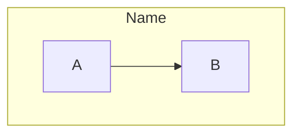
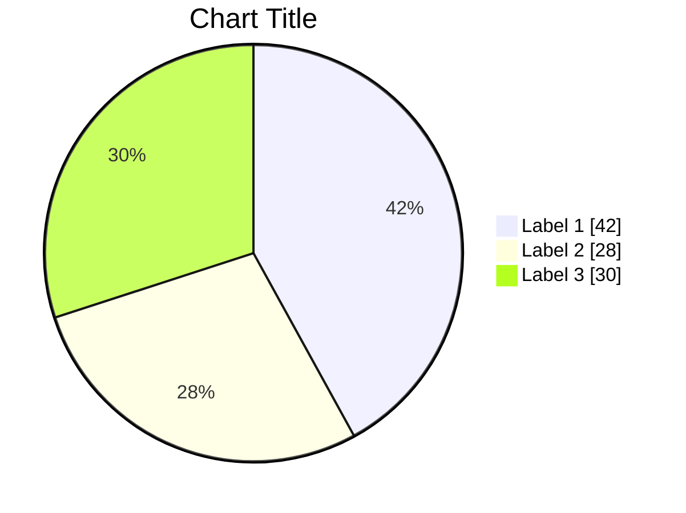
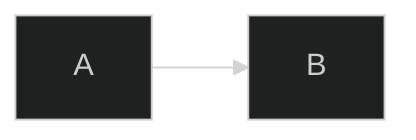
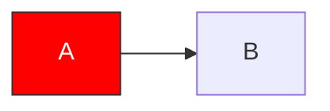
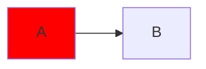
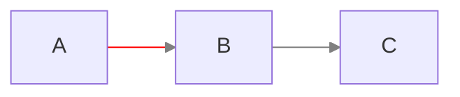
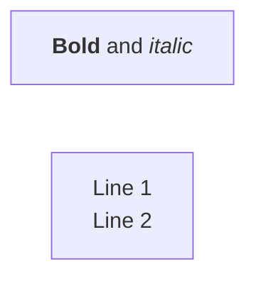
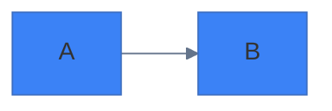

# Mermaid Quick Reference Cheatsheet

Verified against Mermaid v11.16 (2026).

## Contents

- [Diagram Declarations](#diagram-declarations)
- [Flowchart](#flowchart) · [Sequence Diagram](#sequence-diagram) · [Class Diagram](#class-diagram) · [ER Diagram](#er-diagram) · [State Diagram](#state-diagram)
- [Gantt Chart](#gantt-chart) · [Pie Chart](#pie-chart) · [Timeline](#timeline)
- [C4 Diagrams](#c4-diagrams) · [Architecture Diagram](#architecture-diagram)
- [Styling](#styling)
- [Special Characters & Reserved Words](#special-characters--reserved-words)
- [Markdown in Labels](#markdown-in-labels) · [Configuration](#configuration)
- [Quick Decision Guide](#quick-decision-guide)
- [Platform Support](#platform-support)

---

## Diagram Declarations

| Diagram | Declaration | Status |
|---------|-------------|--------|
| Flowchart | `flowchart LR` / `flowchart TB` | Stable |
| Sequence | `sequenceDiagram` | Stable |
| Class | `classDiagram` | Stable |
| ER | `erDiagram` | Stable |
| State | `stateDiagram-v2` | Stable |
| User Journey | `journey` | Stable |
| Gantt | `gantt` | Stable |
| Pie | `pie` / `pie showData` | Stable |
| Mindmap | `mindmap` | Stable |
| Timeline | `timeline` | Stable |
| Git Graph | `gitGraph` | Stable |
| C4 Context | `C4Context` | Experimental |
| C4 Container | `C4Container` | Experimental |
| C4 Component | `C4Component` | Experimental |
| Architecture | `architecture-beta` | Beta |
| Block | `block` (legacy: `block-beta`) | Stable |
| Quadrant | `quadrantChart` | Stable |
| XY Chart | `xychart` (legacy: `xychart-beta`) | Stable |
| Sankey | `sankey` (legacy: `sankey-beta`) | Experimental |
| Kanban | `kanban` | Stable |
| Packet | `packet` (legacy: `packet-beta`) | Stable |
| Requirement | `requirementDiagram` | Stable |
| Treemap | `treemap-beta` | Beta |

Legacy `-beta` aliases still parse in v11; use them only when targeting platforms bundling older Mermaid versions.

---

## Flowchart

### Direction
```
TB / TD   Top to Bottom
BT        Bottom to Top
LR        Left to Right
RL        Right to Left
```

### Node Shapes
```
A[Rectangle]       B(Rounded)         C([Stadium])
D[[Subroutine]]    E[(Database)]      F((Circle))
G{Diamond}         H{{Hexagon}}       I[/Parallelogram/]
J(((Double)))
```

### Edges
```
A --> B       Solid arrow
A --- B       Solid line
A -.-> B      Dotted arrow
A ==> B       Thick arrow
A --o B       Circle end
A --x B       Cross end
A <--> B      Bidirectional
A -->|text| B Labeled
```

### Subgraph


---

## Sequence Diagram

### Messages
```
A->>B     Solid arrow (sync)
A-->>B    Dotted arrow (response)
A-xB      Failed message
A-)B      Async message
```

### Activation
```
A->>+B: Request    Activate B
B-->>-A: Response  Deactivate B
```

### Control Flow
```
alt Condition
    A->>B: If true
else
    A->>B: If false
end

opt Optional
    A->>B: Maybe
end

loop Every 30s
    A->>B: Repeat
end

par Parallel
    A->>B: Task 1
and
    A->>C: Task 2
end
```

### Notes
```
Note right of A: Text
Note over A,B: Spanning note
```

---

## Class Diagram

### Visibility
```
+  Public
-  Private
#  Protected
~  Package
```

### Relationships
```
A <|-- B    Inheritance
A *-- B     Composition
A o-- B     Aggregation
A --> B     Association
A ..> B     Dependency
A ..|> B    Realization
```

### Cardinality
```
A "1" --> "*" B : has
A "0..1" --> "1..*" B
```

### Annotations
```
class A {
    <<interface>>
    +method()
}

class B {
    <<enumeration>>
    VALUE1
    VALUE2
}
```

---

## ER Diagram

### Cardinality
```
||--||    One to one
||--o{    One to many
}o--o{    Many to many (optional)
}|--|{    Many to many (required)
```

### Line Types
```
--    Identifying (solid)
..    Non-identifying (dashed)
```

### Attributes
```
ENTITY {
    type name PK     Primary key
    type name FK     Foreign key
    type name UK     Unique key
    type name        Regular
}
```

---

## State Diagram

### Basic
```
[*] --> State1          Start
State1 --> State2       Transition
State2 --> [*]          End
State1 --> State1       Self-loop
```

### Composite
```
state Parent {
    [*] --> Child1
    Child1 --> Child2
}
```

### Choice
```
state check <<choice>>
A --> check
check --> B : condition1
check --> C : condition2
```

### Fork/Join
```
state fork <<fork>>
state join <<join>>
[*] --> fork
fork --> A
fork --> B
A --> join
B --> join
join --> [*]
```

---

## Gantt Chart

### Task Syntax
```
Task name : [tags], [id], [start], [end/duration]

Completed   :done, t1, 2024-01-01, 7d
Active      :active, t2, after t1, 5d
Critical    :crit, t3, 2024-01-15, 3d
Milestone   :milestone, m1, 2024-01-20, 0d
```

### Dependencies
```
after taskId
after t1 t2    After multiple
```

---

## Pie Chart



---

## Timeline

```
timeline
    title Title
    section Period
        Date : Event 1
             : Event 2
```

---

## C4 Diagrams

### Elements
```
Person(alias, "Label", "Description")
System(alias, "Label", "Description")
System_Ext(alias, "Label", "Description")
Container(alias, "Label", "Tech", "Description")
ContainerDb(alias, "Label", "Tech", "Description")
Component(alias, "Label", "Tech", "Description")
```

### Relationships
```
Rel(from, to, "Label")
Rel(from, to, "Label", "Technology")
BiRel(from, to, "Label")
```

### Boundaries
```
System_Boundary(alias, "Label") {
    Container(...)
}
```

---

## Architecture Diagram

### Groups
```
group id(icon)[Title]
group id(icon)[Title] in parent
```

### Services
```
service id(icon)[Title]
service id(icon)[Title] in group
```

### Edges
```
a:R --> L:b     Right of a to left of b
a:T --> B:b     Top to bottom
<-->            Bidirectional
```

### Icons
`cloud`, `database`, `disk`, `internet`, `server`

---

## Styling

### Theme

The init directive must be followed by a diagram — it never stands alone:


Themes: `default`, `dark`, `forest`, `neutral`, `base`

### Class Definition


### Individual Style


### Link Style


---

## Special Characters & Reserved Words

Wrap labels containing `( ) [ ] { } : ;` or leading digits in double quotes: `A["Fetch (retry)"]`. Inside quoted labels, escape with entity codes:

| Char | Escape |
|------|--------|
| `"` | `#quot;` |
| `#` | `#35;` |
| `<` | `#lt;` |
| `>` | `#gt;` |
| `{` | `#123;` |
| `}` | `#125;` |

Reserved-word traps:

- Flowchart node named `end` (lowercase) breaks parsing — use `End` or `e[end]`
- Flowchart node ID equal to a subgraph ID throws a cycle error — rename the node
- `o`/`x` directly after `---` become circle/cross arrowheads — add a space or capitalize
- Comments: `%%` on its own line (not `//` or `#`)

---

## Markdown in Labels



---

## Configuration



---

## Quick Decision Guide

| Need | Use |
|------|-----|
| Process flow | Flowchart |
| API interactions | Sequence |
| OOP design | Class |
| Database schema | ER |
| State machine | State |
| UX mapping | User Journey |
| Project timeline | Gantt |
| Data distribution | Pie |
| Brainstorming | Mindmap |
| Chronology | Timeline |
| Git branches | Git Graph |
| System architecture | C4 / Architecture |
| Priority matrix | Quadrant |
| Data trends | XY Chart |
| Flow allocation | Sankey |
| Task board | Kanban |
| Protocol structure | Packet |
| Requirements | Requirement |
| Hierarchical proportions | Treemap |
| Grid component layout | Block |

---

## Platform Support

| Platform | Status |
|----------|--------|
| GitHub | Native (markdown, issues, PRs, gists) |
| GitLab | Native |
| VS Code | Built-in preview needs an extension (e.g. Markdown Preview Mermaid Support) |
| Obsidian | Native |
| Notion | Native |
| Confluence | Plugin |
| Docusaurus | Plugin (`@docusaurus/theme-mermaid`) |

Platforms bundle their own Mermaid version, which lags official releases. Core types (flowchart, sequence, class, state, ER, gantt, pie, gitGraph, mindmap, timeline, journey) render everywhere; the newest types (architecture-beta, kanban, packet, treemap, xychart, sankey, block) may not render on a given platform, or may only work under their legacy `-beta` names. Check which version a platform bundles by rendering a code block containing just `info`, or test in the target platform before committing.

